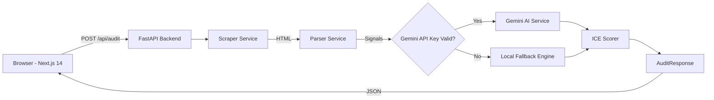

# Shopify CRO Opportunity Engine

> AI-powered Conversion Rate Optimization audit tool for Shopify stores. Scrapes real store data, identifies conversion friction, and outputs a prioritized, scored CRO roadmap with experiment briefs.

[](https://python.org)
[](https://fastapi.tiangolo.com)
[](https://nextjs.org)
[](https://typescriptlang.org)
[](LICENSE)

---

## Features

- **Automated Store Scraping** — Crawls homepage, collection templates, PDPs, and cart pages to harvest real structure and layout evidence
- **AI-Powered CRO Analysis** — Uses Google Gemini to identify conversion opportunities with evidence-cited recommendations
- **Local Fallback Engine** — Rule-based diagnostic mode when Gemini API is unavailable; generates real recommendations from parsed HTML signals
- **ICE Priority Scoring** — Every opportunity scored by Impact, Confidence, and Effort using a mathematical formula
- **Analytics Dashboard** — Interactive Recharts visualizations: CRO Health Score, Impact/Effort scatter matrix, category breakdowns, priority charts
- **Competitor Benchmarking** — Optional competitor URL comparison with gap analysis
- **Experiment Briefs** — A/B test experiment briefs for each identified opportunity
- **Export Support** — Download audit reports as PDF, CSV, or JSON
- **Responsive Design** — Mobile-optimized dashboard with dark-mode landing page

---

## Architecture



---

## Project Structure

```
Shopify-CRO-Opportunity-Engine/
├── backend/
│   ├── app/
│   │   ├── main.py                 # FastAPI app with CORS, logging
│   │   ├── config.py               # Pydantic Settings (env vars)
│   │   ├── models.py               # Request/Response Pydantic models
│   │   ├── routers/
│   │   │   ├── audit.py            # POST /api/audit — full pipeline
│   │   │   └── experiment.py       # GET /api/experiment/brief/:id
│   │   ├── services/
│   │   │   ├── scraper.py          # ScraperService — page fetching
│   │   │   ├── parser.py           # 30+ CRO signal extractors
│   │   │   ├── gemini.py           # Gemini AI integration
│   │   │   └── scorer.py           # ICE score calculation
│   │   └── utils/
│   │       └── helpers.py          # URL validation utilities
│   ├── tests/                      # Pytest test suite
│   ├── requirements.txt
│   └── .env.example
│
├── frontend/
│   ├── app/
│   │   ├── layout.tsx              # Root layout with Inter font, SEO
│   │   ├── page.tsx                # SaaS landing page
│   │   ├── globals.css             # Base styles, animations, print CSS
│   │   ├── results/
│   │   │   └── page.tsx            # Analytics dashboard
│   │   └── components/
│   │       ├── DashboardCharts.tsx  # 6 Recharts chart components
│   │       ├── ExportButtons.tsx   # PDF/CSV/JSON export
│   │       ├── ResultsTable.tsx    # Sortable, paginated data table
│   │       ├── OpportunityCard.tsx # Detailed opportunity cards
│   │       ├── ScoreBadge.tsx      # Circular SVG score badge
│   │       ├── LoadingState.tsx    # Animated loading with progress
│   │       ├── UrlForm.tsx         # URL input with validation
│   │       └── ExperimentBrief.tsx # A/B test brief display
│   ├── lib/
│   │   ├── api.ts                  # Axios API client
│   │   └── types.ts                # TypeScript interfaces
│   ├── package.json
│   └── .env.local.example
│
├── TESTING.md                      # Manual testing checklist
├── render.yaml                     # Render deployment config
├── README.md
└── .gitignore
```

---

## Installation

### Prerequisites

- Python 3.10+
- Node.js 18+
- npm 9+

### Backend Setup

```bash
cd backend

# Create and activate virtual environment
# macOS/Linux:
python -m venv venv && source venv/bin/activate
# Windows (PowerShell):
python -m venv venv; .\venv\Scripts\Activate.ps1
# Windows (CMD):
python -m venv venv && .\venv\Scripts\activate.bat

# Install dependencies
pip install -r requirements.txt

# Create environment file
# macOS/Linux:
cp .env.example .env
# Windows:
Copy-Item .env.example .env

# Edit .env and add your Gemini API key (optional — app works without it)
```

### Frontend Setup

```bash
cd frontend

# Install dependencies
npm install

# Create environment file
# macOS/Linux:
cp .env.local.example .env.local
# Windows:
Copy-Item .env.local.example .env.local
```

---

## Environment Variables

### Backend (`backend/.env`)

| Variable | Required | Default | Description |
|---|---|---|---|
| `GEMINI_API_KEY` | No | `""` | Google AI Studio API key. Leave empty for local fallback mode. |
| `GEMINI_MODEL` | No | `gemini-2.0-flash` | Gemini model name |
| `MAX_PAGES_TO_SCRAPE` | No | `4` | Max pages to scrape per audit |
| `CORS_ORIGINS` | No | `http://localhost:3000` | Comma-separated allowed origins |

### Frontend (`frontend/.env.local`)

| Variable | Required | Default | Description |
|---|---|---|---|
| `NEXT_PUBLIC_API_URL` | No | `http://localhost:8000` | Backend API base URL |

---

## Running the Project

### Start Backend

```bash
cd backend
# Activate your virtual environment first
uvicorn app.main:app --reload --port 8000
```

The API will be available at `http://localhost:8000`

### Start Frontend

```bash
cd frontend
npm run dev
```

The app will be available at `http://localhost:3000`

---

## API Endpoints

### Health Check

```
GET /api/health
Response: { "status": "ok" }
```

### Run Audit

```
POST /api/audit
Content-Type: application/json

{
  "url": "https://allbirds.com",
  "competitor_url": "https://bombas.com"  // optional
}

Response: {
  "store_url": "https://allbirds.com",
  "scraped_pages": ["https://allbirds.com", ...],
  "opportunities": [
    {
      "id": "a1b2c3d4",
      "title": "Enable product filtering on Collection",
      "category": "Collection",
      "impact": "High",
      "confidence": 0.85,
      "effort": "Medium",
      "score": 6.8,
      "evidence": "has_filters: False on collection page",
      "recommendation": "Enable Shopify Search & Discovery app filters...",
      "page_url": "https://allbirds.com/collections/all"
    }
  ],
  "summary": "...",
  "generated_at": "2025-01-15T10:30:00"
}
```

### Audit Status

```
GET /api/audit/status
Response: { "ready": true }
```

### Experiment Brief

```
GET /api/experiment/brief/{opportunity_id}

Response: {
  "opportunity_id": "a1b2c3d4",
  "hypothesis": "If we add product reviews...",
  "control": "Current product page without reviews",
  "variant": "Product page with customer reviews and ratings",
  "primary_metric": "Add-to-Cart Rate",
  "secondary_metrics": ["Conversion Rate", "Time on Page", "Bounce Rate"],
  "estimated_duration": "2-3 weeks at 1,000+ daily visitors"
}
```

---

## Screenshots & Demos

### Landing Page


### Diagnostics Dashboard


### Live Demo Videos

#### 📹 Live Store Audit (Allbirds)


#### 📹 Competitor Benchmarking Audit (Gymshark vs. Ruggable)


---

## Deployment

### Frontend — Vercel

1. Push your repository to GitHub
2. Import the project in [Vercel](https://vercel.com)
3. Set the **Root Directory** to `frontend`
4. Set the **Framework Preset** to `Next.js`
5. Add environment variable: `NEXT_PUBLIC_API_URL` = your Render backend URL
6. Deploy

### Backend — Render

1. Push your repository to GitHub
2. Create a new **Web Service** on [Render](https://render.com)
3. Set the **Root Directory** to `backend`
4. Set the **Build Command** to `pip install -r requirements.txt`
5. Set the **Start Command** to `uvicorn app.main:app --host 0.0.0.0 --port $PORT`
6. Add environment variables:
   - `GEMINI_API_KEY` = your API key
   - `GEMINI_MODEL` = `gemini-2.0-flash`
   - `CORS_ORIGINS` = your Vercel frontend URL
7. Deploy

A `render.yaml` is included for Infrastructure-as-Code deployment.

---

## Future Improvements

- [ ] **Dynamic Experiment Briefs** — Generate contextual A/B test briefs using Gemini instead of static stubs
- [ ] **Historical Audits** — Store audit history with database persistence (PostgreSQL)
- [ ] **Webhook Notifications** — Slack/email alerts when audits complete
- [ ] **Scheduled Re-audits** — Cron-based recurring store monitoring
- [ ] **Lighthouse Integration** — Incorporate Core Web Vitals and performance scores
- [ ] **User Authentication** — Multi-tenant support with auth (Clerk/NextAuth)
- [ ] **Shopify Theme Detection** — Identify the active theme and provide theme-specific recommendations
- [ ] **Revenue Impact Modeling** — Connect to Shopify Analytics API for real revenue lift estimates

---

## License

MIT